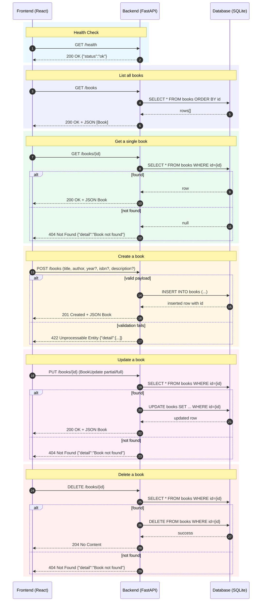

# BookList Application – Sequence Diagrams & API Details

## All Flows in One Diagram



---

## API Details

**Base URL:** `http://localhost:8000`

| Method | Path            | Description            | Request Body   | Success Response                | Errors                      |
|-------:|-----------------|------------------------|----------------|---------------------------------|-----------------------------|
| GET    | `/health`       | Health check           | —              | `200 {"status":"ok"}`           | —                           |
| GET    | `/books`        | List all books         | —              | `200 [Book]`                    | —                           |
| POST   | `/books`        | Create a new book      | `BookCreate`   | `201 Book`                      | `422` validation            |
| GET    | `/books/{id}`   | Get one book by id     | —              | `200 Book`                      | `404 Book not found`        |
| PUT    | `/books/{id}`   | Update a book          | `BookUpdate`   | `200 Book`                      | `404` not found, `422`      |
| DELETE | `/books/{id}`   | Delete a book          | —              | `204 No Content`                | `404 Book not found`        |

```
