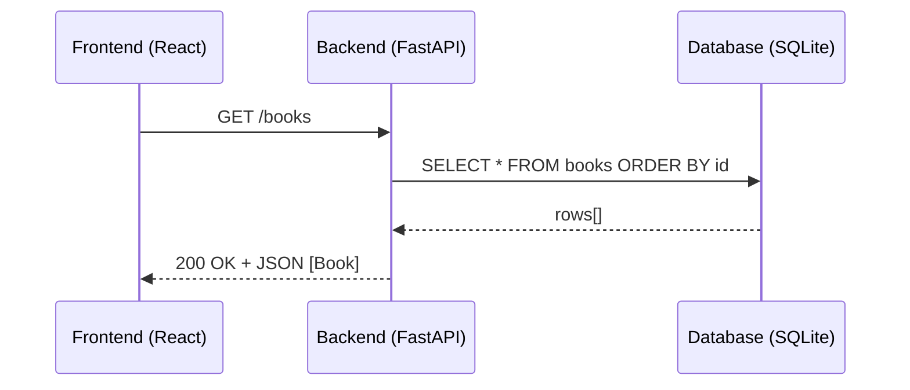
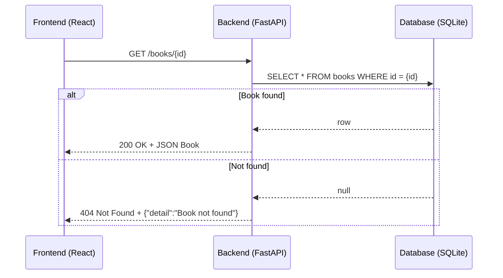
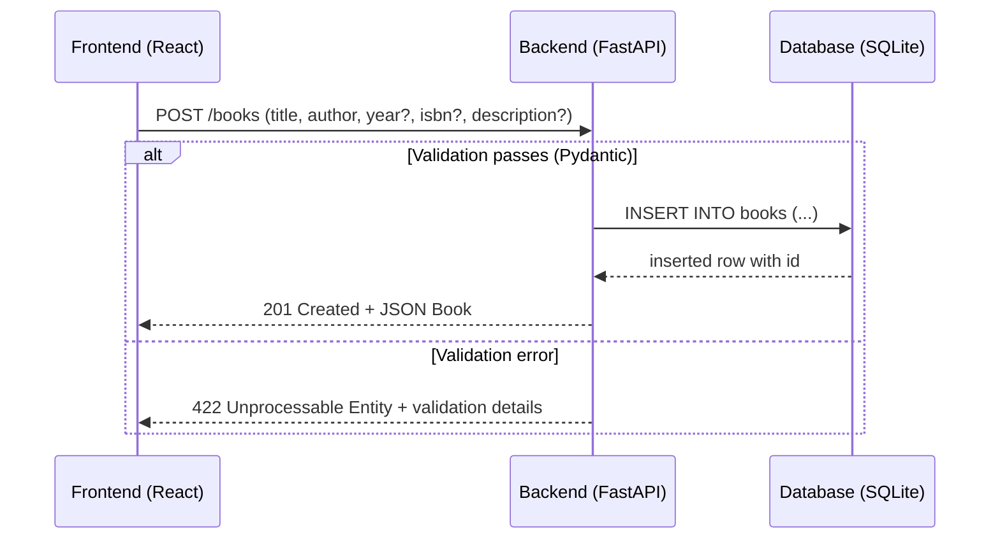
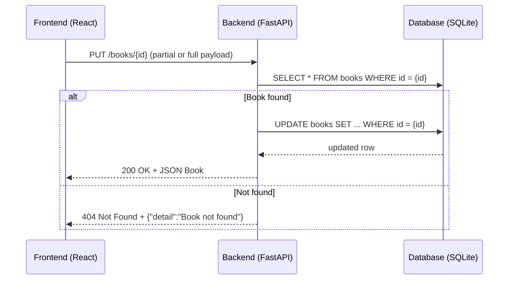
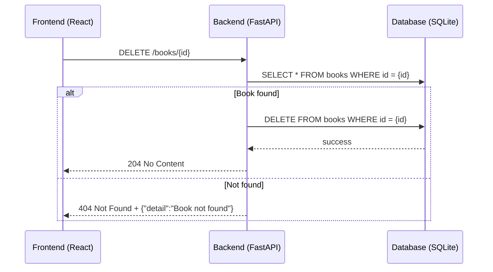
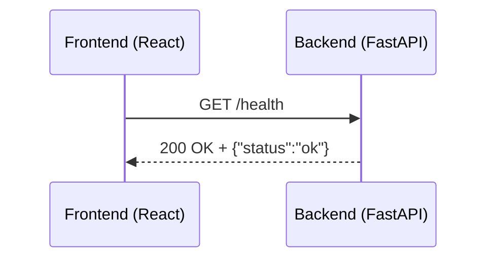

# BookList Application – Sequence Diagrams & API Details

## Sequence Diagrams

### 1) List all books

### 2) Get a single book

### 3) Create a book

### 4) Update a book

### 5) Delete a book

### 6) Health check

